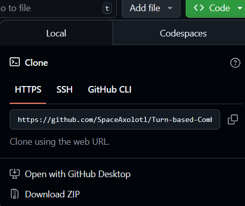
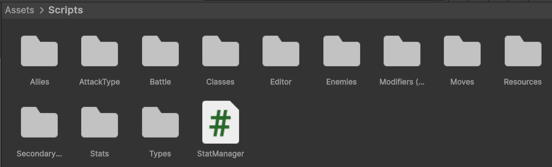
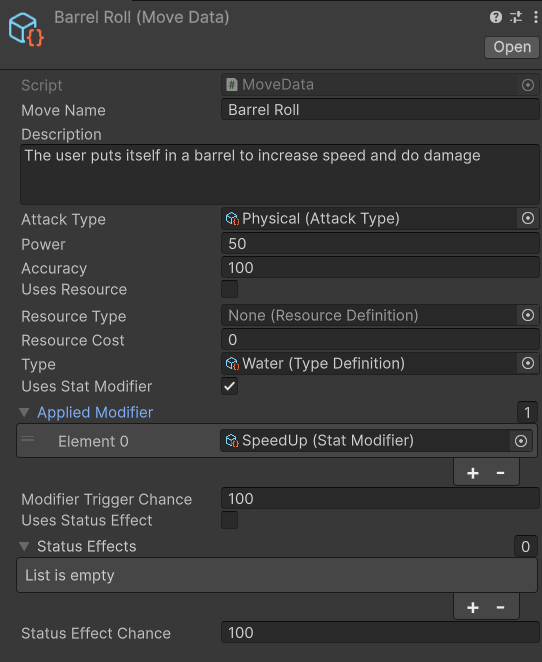
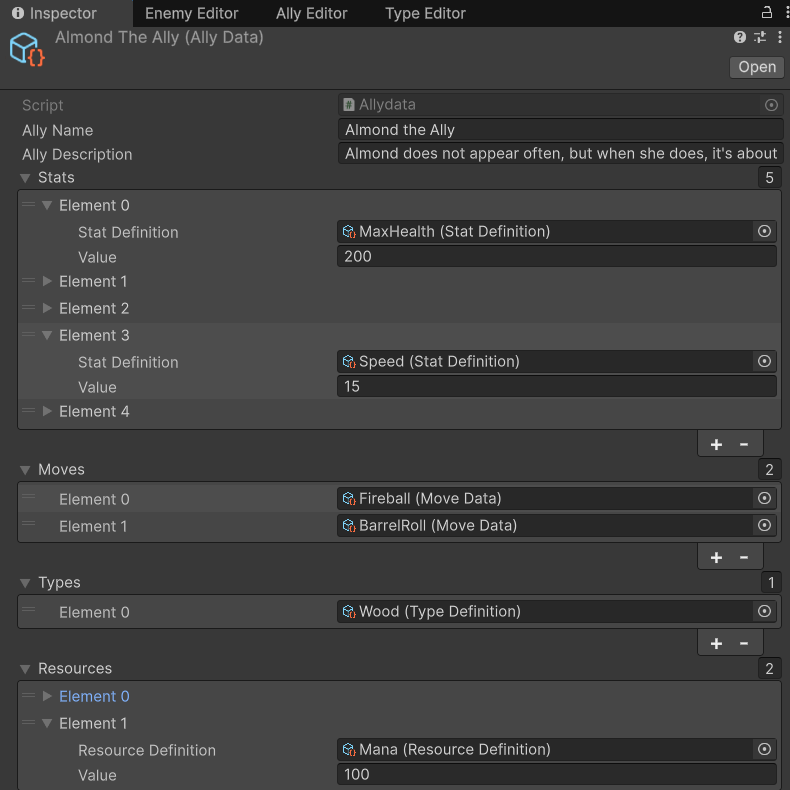

## **1v1 Pokémon-esque Turn-based Combat Manager Tool**

## Introduction
This is a tool that helps with setting up a pokémon-esque 1v1 turn-based combat system.
It is made using Unity version 6000.0.39f1
It uses Scriptable Objects and Classes as its basis to work.

It makes it easy to set up the following: 
-Allies and enemies, each with their own types, stats and movesets.  
-New types with their own weaknesses and strengths  
-Custom statistics  
-Custom resources, like mana, shield or HP.  
-Secondary effects like statboosts and resource drain  
-Moves with their own stats and secondary effects  
-Attack types (which stat the move uses to attack).  

## Installation

if using Github, download the codebase like this:  
  

## Project Setup
*Where do I create a new move/statistic/resource/attacktype/ally or enemy?*

Creating an individual element is done in its respective folder.  
  
Then, add it to its respective library to make sure the rest of the system use it.

Adding extra values or a check can be done in the script. Usually called ...data, but some scripts use ...definition (this is an issue and should still be updated):
  

## Use Case Examples

Making moves (as found in the Libraries and Data folder)  
 

Making allies or enemies  
 

## AI Usage
This project uses AI in its code

## Issues

Everything about setting up the data containers and values works, but there are still some problems with the combat code, battleUI and TurnManager  
-The current combat system only allows for doing damage (not added effects or status effects)  
-Moves can't use resources in actual battle.  
-BattleUI currently does not correctly display and update the currenthealth values.  

## Contributing
Contributing to this code is entirely allowed, but code must be approved by the creator via a push request

## License
CC0 -[Creative Commmons](https://creativecommons.org/public-domain/cc0/)
